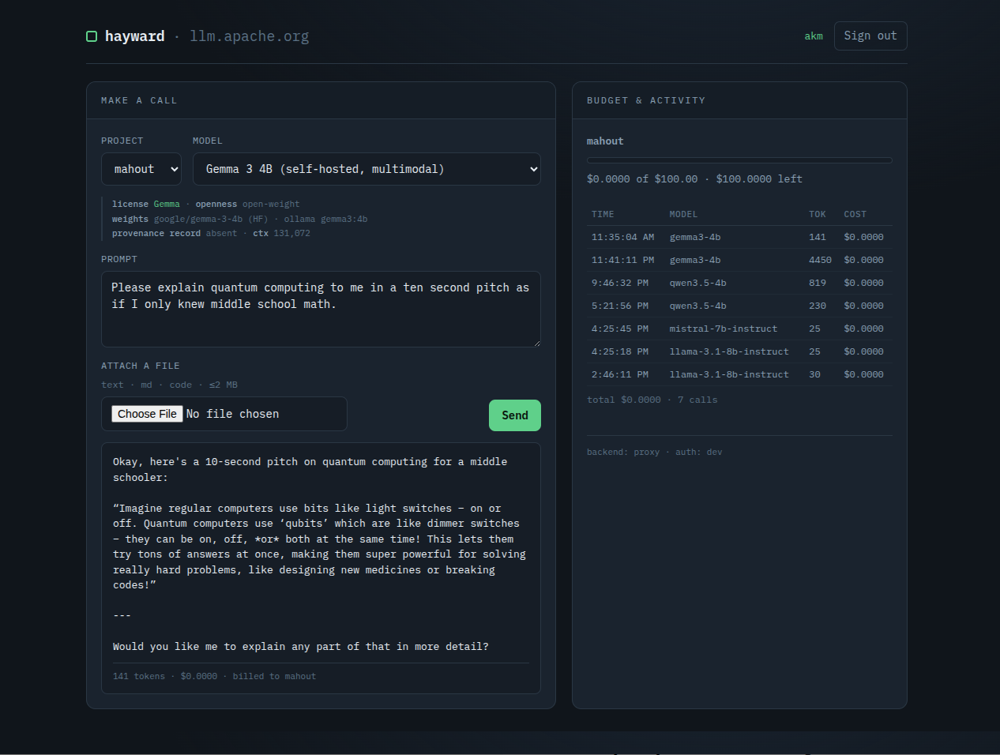

# Hayward

A thin **litellm-proxy gateway fronted by asfquart**, served at `llm.apache.org`.
This is **Phase 1**: ASF identity, per-PMC budgets, a model catalog with
governance metadata, and manual model selection — text or file in, metered
response out.

<p align="center">
  
</p>

`asfquart` owns identity and per-PMC authorization. litellm owns the catalog,
budgets, metering, and the OpenAI-compatible API. The code in this repo is the
**seam** between them, plus a thin portal.

```
ASF id ──oauth/JWT──►  asfquart front  ──team key──►  litellm proxy ──►  models
                       (who you are,                  (what it cost,      (external +
                        what PMCs)                      per-team budget)    self-host)
```

---

## Quickstart (no external services)

Runs out of the box in **dev mode** (stub login) with a **mock LLM backend**,
so you can click through the whole flow on a laptop.

```bash
make install        # creates a local .venv and installs deps into it
make run            # serves http://127.0.0.1:8080
```

`make` builds an isolated `.venv` so it works on Debian/Ubuntu's
"externally managed" Python (PEP 668) without touching your system packages.
If you'd rather manage the environment yourself:

```bash
python3 -m venv .venv && source .venv/bin/activate
pip install -r requirements-dev.txt
python -m hayward.app
```

Open <http://127.0.0.1:8080>, click **Sign in (dev)**, and stand in as an
identity — e.g. uid `jdoe`, projects `airflow, lineage`, PMC `airflow`. Then:

- pick a model (note the license / openness / provenance shown inline),
- type a prompt or attach a text/code file,
- **Send** — the call is metered and billed to the selected project,
- watch the **Budget & activity** panel update (activity is visible to PMC
  members of the project).

Run the tests:

```bash
make test          # 10 tests: seam, budgets, authz, catalog, HTTP API
```

---

## What Phase 1 includes

| Capability | Where it lives | Notes |
|---|---|---|
| ASF login + PMC authz | `auth.py` + asfquart (prod) | dev-stub mirrors asfquart's `ClientSession` shape |
| Per-PMC budgets & spend | litellm teams (prod) / `MockBackend` (dev) | one litellm *team* per ASF project |
| Project ↔ team mapping | `seam.py` | the one real piece of Phase 1 code |
| Model catalog + governance metadata | `catalog.py` | license, openness, weights, provenance (explicit) |
| OpenAI-compatible chat API | `app.py` `/v1/chat/completions` | text or uploaded file |
| Per-project activity view | `app.py` `/v1/projects/<p>/usage` | PMC admins / site admins only |
| Thin portal | `portal.py` | single self-contained page, no build step |

**Deferred to later phases:** input scanning (Phase 2), automatic routing
(Phase 3), benchmarking (Phase 4). Models are chosen by hand in Phase 1.

---

## API

All endpoints require an authenticated session (cookie) or, in asf mode, a
bearer PAT. The chat endpoint is OpenAI-shaped, so existing clients work by
changing the base URL.

```bash
# List approved models (with governance metadata under `.hayward`)
GET /v1/models

# Chat. The billed project comes from the X-Hayward-Project header,
# the body's "project", or (if you're on exactly one) your sole project.
POST /v1/chat/completions
  { "model": "openai/gpt-4o-mini", "messages": [{"role":"user","content":"hi"}] }

# Per-project budget (members) and activity (PMC admins)
GET /v1/projects/<project>/budget
GET /v1/projects/<project>/usage
```

Errors use standard codes: `401` unauthenticated, `403` not a member / not a
PMC admin, `404` unknown model, `429` project budget exceeded, `504` the model
timed out or the proxy was unreachable. Error bodies are always JSON.

---

## Production

Two environment flips move from the laptop demo to the real thing:

```bash
export HAYWARD_AUTH_MODE=asf          # oauth.apache.org + LDAP via asfquart
export HAYWARD_LITELLM_MODE=proxy     # talk to a real litellm proxy
```

1. **Install asfquart** (provides the OAuth gateway at `/auth`, JWT/PAT, and
   LDAP-backed sessions): see
   <https://github.com/apache/infrastructure-asfquart>. In asf mode the app is
   built with `asfquart.construct("hayward")`, so login and PMC membership come
   from real ASF identity.

2. **Run the litellm proxy** with the generated config:

   ```bash
   make config        # regenerate litellm/config.yaml from the catalog
   make proxy         # litellm --config litellm/config.yaml
   ```

   Set the self-host endpoint (e.g. `HAYWARD_OLLAMA_BASE_URL`, or a vast.ai
   vLLM URL) and any external provider keys (`OPENAI_API_KEY`, etc.). Set
   `HAYWARD_LITELLM_MASTER_KEY` to the same value as the proxy's `master_key`;
   the seam uses it to provision teams and mint per-team keys.

3. **Serve** behind hypercorn and point DNS/TLS for `llm.apache.org` at it.

The PAT handler in `auth.py` (`make_token_handler`) is a stub: wire it to your
token store to let non-interactive CLI/SDK callers authenticate.

### Using a local Ollama as the self-host backend

The self-host catalog entries are wired to a local Ollama via the litellm
proxy, so you develop against real local models while keeping real per-PMC
budget enforcement (budgets live in litellm, which Ollama lacks). The seeded
self-host tier is sized for a 6GB GPU (e.g. GTX 1060):

| Catalog model | Ollama tag | ~Size | Good for |
|---|---|---|---|
| Qwen2.5-Coder 7B | `qwen2.5-coder:7b` | 4.7GB | code: write, explain, debug, review |
| Qwen3.5 4B | `qwen3.5:4b` | 3.4GB | documents / general — **recommended default** |
| Gemma 3 4B | `gemma3:4b` | 3.3GB | multimodal, RAM-efficient |
| Qwen3 8B | `qwen3:8b` | 5.2GB | reasoning step-up (at the 6GB edge) |
| DeepSeek-R1 8B | `deepseek-r1:8b` | 5.2GB | reasoning with visible `<think>` (slower) |

```bash
ollama pull qwen2.5-coder:7b
ollama pull qwen3.5:4b
ollama pull gemma3:4b
ollama pull qwen3:8b
ollama pull deepseek-r1:8b
ollama list
```

Notes: the 8B models sit right at 6GB and will spill slightly to CPU — usable
but slower than the 4B picks. DeepSeek-R1 8B is a *distill* (not the 671B R1)
and emits a `<think>` chain-of-thought before its answer. Gemma 3 has weaker
tool-calling, fine for Phase 1 chat. Check fit with `ollama run <tag> "hi"`
then `ollama ps` (the PROCESSOR column shows the GPU/CPU split).

Slow models: the gateway waits `HAYWARD_REQUEST_TIMEOUT_S` (default 600s) for a
response. A reasoning model on a modest GPU can exceed that; if a call times out
the portal says so and returns a `504` (it does not hang or show a raw error).
Prefer a non-reasoning model like `gemma3:4b` for document rewrites to stay well
under the limit, or raise the timeout for big jobs.

```bash
export HAYWARD_OLLAMA_BASE_URL=http://localhost:11434
export HAYWARD_LITELLM_MODE=proxy
make proxy            # terminal 1: litellm proxy in front of Ollama
make run              # terminal 2: Hayward
```

**Adding or changing a model touches two files that must agree:**
`hayward/catalog.py` (what the portal lists, plus governance metadata) and
`litellm/config.yaml` (the Ollama route). Each catalog `backend` string must
equal a config `model_name`. Edit the catalog, set the tag in the
`OLLAMA_TAGS` map in `scripts/render_litellm_config.py`, then `make config` to
regenerate the config so they stay in sync.

Notes: Gemma defaults to a 4K context in Ollama, so the generated config sets
`num_ctx` explicitly; Phase 1's portal upload is text-only, so Gemma's image
input isn't exercised through the UI yet.

---

## The catalog is the source of truth

`hayward/catalog.py` defines the models and their governance metadata. The
litellm proxy config is generated from it (`scripts/render_litellm_config.py`),
so the portal's list and the proxy's routes never drift. Add a model by adding
a `CatalogModel`, then `make config`.

---

## Layout

```
hayward/
  app.py            app factory + routes (dev: plain Quart; prod: asfquart)
  seam.py           ASF project -> litellm team; authz; metered chat
  auth.py           identity resolution (asfquart session/PAT or dev stub)
  litellm_client.py ProxyBackend (real) + MockBackend (dev), one interface
  catalog.py        models + license/openness/weights/provenance
  portal.py         the single-page portal
  store.py          tiny JSON state store (swap for a DB later)
  config.py         env-driven settings
litellm/config.yaml litellm proxy config (generated)
scripts/            config renderer
tests/              Phase 1 test suite
```